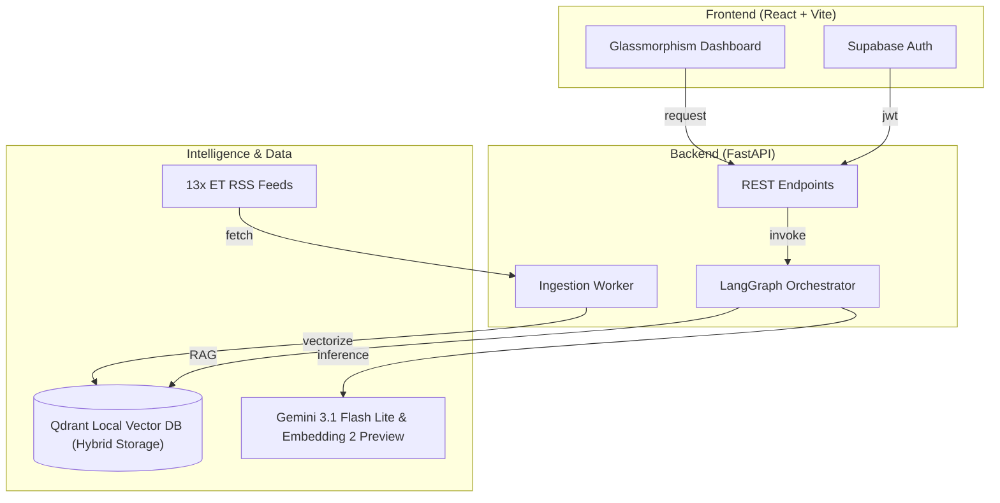
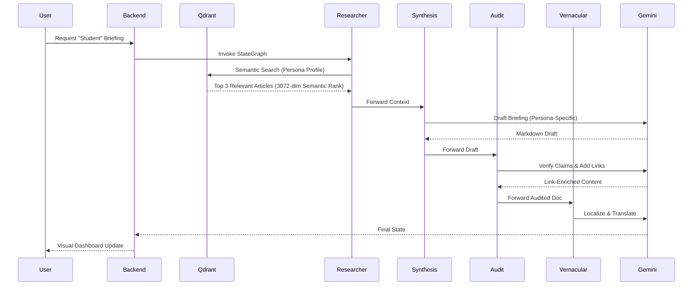

# 🏛️ ET News-Sphere: System Architecture

This document outlines the technical architecture of **ET News-Sphere**, highlighting the multi-agent orchestration, data pipeline, and the "Active Intelligence" framework.

---

## 🏗️ High-Level Architecture
ET News-Sphere is built on a modern **RAG (Retrieval-Augmented Generation)** stack, using a decoupled micro-architecture where the frontend communicates with a FastAPI backend powered by LangGraph.

### **The Intelligence Lifecycle (Sequence)**
The following diagram illustrates how the agents transform raw news into a personalized briefing:

---

## 🤖 The Multi-Agent Newsroom (LangGraph)
Our core intelligence is guided by a **Stateful Graph** that ensures news is not just "summarized" but "audited" and "personalized."

### **Agent Roles & Communication**
The workflow follows a deterministic state transition (`AgentState`) to maintain context:

1.  **🔍 Researcher Agent**: 
    - **Role**: Information Retrieval.
    - **Logic**: Expands the user's Persona (e.g., "Student") into a rich interest profile and queries Qdrant for the top 3 most relevant articles (Balanced for sub-20s synthesis).
2.  **✍️ Synthesis Agent**:
    - **Role**: Creative Contextualization.
    - **Logic**: Merges fragmented article bodies and tailors the narrative voice to the specific needs of the Persona.
3.  **🛡️ Audit Agent**:
    - **Role**: Factual Integrity.
    - **Logic**: Scans the draft for claims and enforces clickable Markdown citations `[[Source X]](url)` back to original ET articles.
4.  **🌐 Vernacular Agent**:
    - **Role**: Localization.
    - **Logic**: Performs context-aware translation into Hindi, Tamil, Telugu, or Bengali while preserving all formatting and links.

---

## 🚥 Tool Integrations & Data Flow

### **1. The Ingestion Pipeline**
- **BeautifulSoup4**: Custom scraper that strips "junk" (ads, related links) and extracts the high-quality **Synopsis** or **Open Graph (OG) Description** for the summary view.
- **Deterministic Deduplication**: Articles are indexed by a URL-based UUID to prevent duplicate news entries.

### **2. Strategic Vector Search**
- **Dynamic Persona Mapping**: We map simple roles to professional interest profiles (e.g., "Retail Investor" -> "Stock trends, Mutual funds, Wealth management") to provide deeper semantic matches than a simple keyword search.

### **3. Intelligence Interrogation (Follow-up Chat)**
- **Feature**: Users can ask questions about any briefing or article.
- **Under the Hood**: Uses native `ainvoke` with a 60s safety timeout to ensure non-blocking high-speed interaction.

### **4. System Performance & Security**
- **Offline JWT Decoding**: Backend validates user sessions locally to eliminate the network-bound latency of remote auth checks.
- **Embedding Engine**: 100% Cloud Intelligence. Exclusively uses **Google Embeddings API (3072-dim)** for high-precision vectorization. This eliminates all local binary dependencies (Torch/Rust) and ensures a lightweight, stable deployment. Quota optimized via structured looping.

---

## 🛡️ Error Handling & Resilience
- **Database Safety**: Qdrant client implements a fallback to `:memory:` storage if the local disk is locked by another process.
- **API Exponential Backoff**: Uses the `tenacity` library to handle rate-limiting or transient network failures during embedding generation.
- **Graceful Failbacks**: If the Vernacular Agent fails to translate a batch of news (e.g., API overload), the system gracefully falls back to the original English content to ensure the UI remains functional.
- **Scraper Robustness**: If an article lacks a formal summary, the scraper cascades through `OG Description` -> `Meta Description` -> `Synopsis` -> `Auto-Summarization` to ensure the user never sees an empty card.

---
*Prepared for the ET Gen AI Hackathon 2026*
