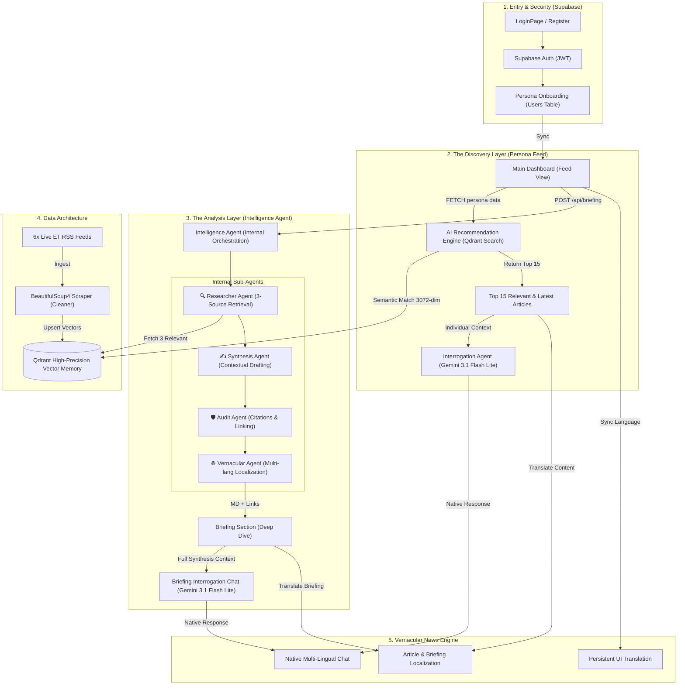

# 🏛️ ET News-Sphere: Full-Project Architecture (End-to-End)

This document provides a comprehensive, high-fidelity roadmap of **ET News-Sphere**, tracing the complete project lifecycle from user authentication to AI-driven intelligence delivery.

---

##  Full-Project Roadmap (User Journey)
The following diagram maps the entire flow, from initial splash screens through to interactive AI synthesis.

---

## 🤖 Core Intelligence Systems and Their Roles

### **1. AI Recommendation Engine (The Persona Feed)**
The **Persona Feed** uses advanced vector search to eliminate information overload.
-   **Discovery**: The system expands your Persona (e.g., "Student") into a rich interest profile.
-   **Precision**: It performs a semantic search across **Qdrant** using 3072-dimensional embeddings, fetching the **Top 15** articles that are both latest and highly relevant to your professional needs.
-   **Deep Context Chat**: Each article in the feed includes a dedicated **Interrogation Agent**, allowing you to ask follow-up questions about the entire article body using Gemini 3.1 Flash Lite.

### **2. The Intelligence Agent (The Briefing Engine)**
The **Intelligence Agent** is the "Newsroom Core" of the project. It provides deep-dive briefings by orchestrating four functional sub-agents:
1.  **🔍 Researcher Agent**: Pulls the 3 most relevant Economic Times articles based on the active topic.
2.  **✍️ Synthesis Agent**: Merges fragmented data points into a cohesive, persona-driven report.
3.  **🛡️ Audit Agent**: Ensures every claim is verified and linked back to official ET coverage.
4.  **🌐 Vernacular Agent**: A sub-role representing the bridge to our broader Translation Engine.
-   **Briefing Chat**: Like individual articles, the synthesized briefings support their own **Interrogation Chat**, allowing for deep thematic exploration.

### **3. Vernacular News Engine**
The **Vernacular News Engine** is a cross-platform system that ensures the entire experience is accessible in the user's preferred language.
-   **Persistence UI Translation**: Translates and persists the entire dashboard and navigation elements based on the User DNA (Language setting) stored in Supabase.
-   **Content Localization**: Performs high-fidelity translation of every individual article and the synthesized briefings into **English, Hindi, Tamil, Telugu, and Bengali**.
-   **Multi-Lingual Chat**: The interrogation agents (Gemini 3.1 Flash Lite) are configured to detect and respond in the user's selected language, ensuring the follow-up questions feel native and natural.

---

##  Technical Foundation Layer and Tool Integration

- **Authentication & Profiles**: Powered by **Supabase**. Persona data and target languages are persisted in relational tables to ensure cross-device consistency.
- **Memory Layer**: Powered by **Qdrant & Google GenAI SDK**. We use google embeddings `google-embedding-2` to create a high-precision vector space where "meaning" is indexed alongside "text."
- **Inference Engine**: Powered by **Google Gemini 3.1 Flash Lite**. Chosen for its 128k context window and high speed, making "Analysis-on-the-Fly" possible.
- **The Ingestion Pipeline**: Built with **BeautifulSoup4**. A custom scraper that strips "junk" (ads, related links) and extracts high-quality Synopsis or Open Graph (OG) Description for summary view. **Deterministic Deduplication** where articles are indexed by a URL-based UUID to prevent duplicate entries.
- **Strategic Vector Search**: Implements **Dynamic Persona Mapping**. We map simple roles (e.g., "Retail Investor") to deep professional interest profiles (e.g., "Stock trends, Mutual funds") to ensure high-fidelity semantic discovery beyond keyword matching.

### **Error Handling & Resilience**
- **Database Safety**: Qdrant client implements an automatic fallback to `:memory:` storage if the local disk is locked by another process, ensuring the application remains operational.
- **API Exponential Backoff**: Integrates the `tenacity` library to handle rate-limiting and transient network failures during embedding generation and LLM calls.
- **Graceful Failbacks (Vernacular)**: If the Vernacular Agent fails to translate content (e.g., API overload or quota limits), the system gracefully falls back to the original English content to ensure UI functionality.
- **Scraper Robustness**: The ingestion engine uses a cascading extraction logic (OG Description -> Meta Description -> Synopsis -> Auto-Summarization) to ensure articles never display empty cards.
- **Cloud-First Intelligence**: Exclusively uses the Google GenAI SDK for vectorization. By avoiding heavy local binary dependencies (like Torch or Rust-based tokenizers), the system maintains a lightweight, cross-platform stable deployment.
- **Dependency Optimization**: Stripped of the monolithic `langchain` package, the backend uses only `langchain-core` and `langgraph` to minimize disk footprint and memory overhead.
- **Auth Safety**: JWTs are verified locally at the backend to prevent API latency during auth checks.
- **Content Resilience**: If an RSS feed is down, the system cascades into our internal database "Scroll" fallback to ensure the user always sees news.

---
*Prepared for the ET Gen AI Hackathon 2026*
*Built with ❤️ for Technical Excellence*
